# NutritAI Architecture Diagram

Copy this Mermaid code to generate a PNG:

```mermaid
graph TB
    subgraph "Flutter Mobile Client"
        UI[Flutter UI Widgets]
        StateManager[Provider/Riverpod State]
        LocalAuth[Local Authentication]
        Camera[Flutter Camera]
        LocalStorage[Hive Local Storage]
        TFLite[TensorFlow Lite Engine]
        ModelLite2[EfficientNet-Lite2 Model]
    end
    
    subgraph "API Gateway"
        Gateway[API Gateway]
        RateLimit[Rate Limiting]
        LoadBalancer[Load Balancer]
    end
    
    subgraph "Backend Services"
        AuthService[Authentication Service]
        UserService[User Profile Service]
        ImageService[Image Processing Service]
        NutritionService[Nutrition Calculation Service]
        MealPlanService[Meal Planning Service]
        ScoringService[Scoring Engine Service]
        SubService[Subscription Service]
    end
    
    subgraph "AI Services"
        ModelB4[EfficientNet-B4 Cloud Model]
        IndianHead[Indian Food Head]
        Food101Head[Food101 Head]
        MealPlanAI[Meal Planning AI]
    end
    
    subgraph "Data Layer"
        UserDB[(User Database)]
        NutritionDB[(Nutrition Database)]
        ImageStore[(Image Storage)]
        Cache2[(Redis Cache)]
    end
    
    subgraph "External Services"
        USDA[USDA Database]
        Payment[Payment Gateway]
        Push[Push Notifications]
    end
    
    subgraph "Model Training Pipeline"
        Colab[Google Colab Notebooks]
        TrainingData[Indian Food + Food101 Datasets]
        ModelTraining[Multi-headed NN Training]
        ModelConversion[B4 → Lite2 Conversion]
    end
    
    UI --> StateManager
    Camera --> TFLite
    TFLite --> ModelLite2
    UI --> Gateway
    
    Gateway --> AuthService
    Gateway --> ImageService
    Gateway --> NutritionService
    Gateway --> MealPlanService
    Gateway --> ScoringService
    Gateway --> SubService
    
    ImageService --> ModelB4
    ModelB4 --> IndianHead
    ModelB4 --> Food101Head
    MealPlanService --> MealPlanAI
    NutritionService --> USDA
    
    AuthService --> UserDB
    UserService --> UserDB
    NutritionService --> NutritionDB
    ImageService --> ImageStore
    
    SubService --> Payment
    UserService --> Push
    
    Colab --> TrainingData
    Colab --> ModelTraining
    ModelTraining --> ModelConversion
    ModelConversion --> ModelLite2
    ModelConversion --> ModelB4
```



## How to Convert to PNG:

### Option 1: Mermaid Live Editor
1. Go to https://mermaid.live/
2. Copy the code above
3. Paste it into the editor
4. Click "Export" → "PNG"

### Option 2: VS Code Extension
1. Install "Mermaid Markdown Syntax Highlighting" extension
2. Open this file in VS Code
3. Right-click on the diagram → "Export Mermaid Diagram"

### Option 3: Command Line (if you have mermaid-cli)
```bash
mmdc -i architecture-diagram.md -o architecture-diagram.png
```