# Design Document: NutritAI Mobile Application

## Overview

NutritAI is a comprehensive mobile nutrition tracking application that leverages AI-powered image recognition and nutritional analysis to provide users with automated meal tracking, personalized meal planning, and nutritional scoring. The system operates on a freemium model with basic macro-nutrient tracking available to all users and advanced micro-nutrient analysis reserved for premium subscribers.

The application architecture follows a client-server model with a React Native mobile client, Node.js/Express backend API, and cloud-based AI services for image processing and meal planning. The system integrates with external nutritional databases and implements robust data synchronization, security, and performance optimization features.

## Architecture

### High-Level Architecture

```mermaid
graph TB
    subgraph "Flutter Mobile Client"
        UI[Flutter UI Widgets]
        StateManager[Provider/Riverpod State]
        LocalAuth[Local Authentication]
        Camera[Flutter Camera]
        LocalStorage[Hive Local Storage]
        TFLite[TensorFlow Lite Engine]
        ModelLite2[EfficientNet-Lite2 Model]
    end
    
    subgraph "API Gateway"
        Gateway[API Gateway]
        RateLimit[Rate Limiting]
        LoadBalancer[Load Balancer]
    end
    
    subgraph "Backend Services"
        AuthService[Authentication Service]
        UserService[User Profile Service]
        ImageService[Image Processing Service]
        NutritionService[Nutrition Calculation Service]
        MealPlanService[Meal Planning Service]
        ScoringService[Scoring Engine Service]
        SubService[Subscription Service]
    end
    
    subgraph "AI Services"
        ModelB4[EfficientNet-B4 Cloud Model]
        IndianHead[Indian Food Head]
        Food101Head[Food101 Head]
        MealPlanAI[Meal Planning AI]
    end
    
    subgraph "Data Layer"
        UserDB[(User Database)]
        NutritionDB[(Nutrition Database)]
        ImageStore[(Image Storage)]
        Cache2[(Redis Cache)]
    end
    
    subgraph "External Services"
        USDA[USDA Database]
        Payment[Payment Gateway]
        Push[Push Notifications]
    end
    
    subgraph "Model Training Pipeline"
        Colab[Google Colab Notebooks]
        TrainingData[Indian Food + Food101 Datasets]
        ModelTraining[Multi-headed NN Training]
        ModelConversion[B4 → Lite2 Conversion]
    end
    
    UI --> StateManager
    Camera --> TFLite
    TFLite --> ModelLite2
    UI --> Gateway
    
    Gateway --> AuthService
    Gateway --> ImageService
    Gateway --> NutritionService
    Gateway --> MealPlanService
    Gateway --> ScoringService
    Gateway --> SubService
    
    ImageService --> ModelB4
    ModelB4 --> IndianHead
    ModelB4 --> Food101Head
    MealPlanService --> MealPlanAI
    NutritionService --> USDA
    
    AuthService --> UserDB
    UserService --> UserDB
    NutritionService --> NutritionDB
    ImageService --> ImageStore
    
    SubService --> Payment
    UserService --> Push
    
    Colab --> TrainingData
    Colab --> ModelTraining
    ModelTraining --> ModelConversion
    ModelConversion --> ModelLite2
    ModelConversion --> ModelB4
```



### Technology Stack

**Mobile Client:**
- Flutter for cross-platform development
- Provider/Riverpod for state management
- Flutter Camera plugin for image capture
- Hive/SharedPreferences for local data persistence
- Local Authentication plugin for biometric authentication

**Backend Services:**
- Python with FastAPI framework
- Pydantic for data validation and type safety
- JWT for authentication
- Microservices architecture with Docker containers

**AI Services:**
- Python-based model training in Google Colab notebooks
- Multi-headed neural network architecture with two heads:
  - Indian food dataset head
  - Food101 dataset head
- EfficientNet-B4 for training on pretrained weights
- EfficientNet-Lite2 for mobile deployment (converted from B4)
- TensorFlow Lite for on-device inference
- Custom meal planning algorithms
- Cloud-based model serving for backup/fallback

**Data Storage:**
- PostgreSQL for relational data (users, meals, goals)
- MongoDB for flexible nutrition data
- Redis for caching and session management
- AWS S3 for image storage

**Infrastructure:**
- AWS/Google Cloud for hosting
- API Gateway for request routing
- Container orchestration with Kubernetes
- CDN for image delivery
- Google Colab for model training and experimentation
- Model versioning and deployment pipeline

## Components and Interfaces

### Core Components

#### 1. Image Processing Service

**Responsibilities:**
- Receive and validate uploaded meal images
- Coordinate with on-device EfficientNet-Lite2 model for primary inference
- Fall back to cloud-based EfficientNet-B4 model for complex cases
- Manage image storage and retrieval
- Handle image preprocessing and optimization for mobile inference

**Architecture Details:**
- **Primary Processing**: On-device EfficientNet-Lite2 model for fast, offline inference
- **Multi-headed Architecture**: Two specialized heads for Indian food and Food101 datasets
- **Fallback Processing**: Cloud-based EfficientNet-B4 model for uncertain cases
- **Model Management**: Automatic model updates and version management

**Key Methods:**
```python
from abc import ABC, abstractmethod
from typing import List, Optional, Union
from pydantic import BaseModel
from enum import Enum

class ImageProcessingService(ABC):
    @abstractmethod
    async def process_image_on_device(self, image_data: bytes, user_id: str) -> 'FoodIdentificationResult':
        pass
    
    @abstractmethod
    async def process_image_cloud(self, image_data: bytes, user_id: str) -> 'FoodIdentificationResult':
        pass
    
    @abstractmethod
    async def validate_image_quality(self, image_data: bytes) -> 'ImageQualityResult':
        pass
    
    @abstractmethod
    async def store_image(self, image_data: bytes, user_id: str) -> str:
        pass
    
    @abstractmethod
    async def get_processing_status(self, job_id: str) -> 'ProcessingStatus':
        pass

class ModelType(Enum):
    LITE2_ON_DEVICE = "lite2_on_device"
    B4_CLOUD = "b4_cloud"

class FoodDatasetHead(Enum):
    INDIAN_FOOD = "indian_food"
    FOOD101 = "food101"

class FoodIdentificationResult(BaseModel):
    foods: List['IdentifiedFood']
    confidence: float
    processing_time_ms: int
    suggestions: Optional[List['FoodSuggestion']] = None
    used_model: ModelType

class IdentifiedFood(BaseModel):
    name: str
    confidence: float
    portion_size: 'PortionEstimate'
    bounding_box: 'BoundingBox'
    source_head: FoodDatasetHead
```
```

#### 2. Nutrition Calculation Service

**Responsibilities:**
- Calculate macro and micro-nutrients from identified foods
- Integrate with external nutritional databases
- Handle portion size calculations
- Aggregate nutritional data for meals and daily totals

**Key Methods:**
```python
from abc import ABC, abstractmethod
from typing import List, Optional, Dict
from pydantic import BaseModel
from enum import Enum

class NutritionCalculationService(ABC):
    @abstractmethod
    async def calculate_nutrition(self, foods: List['IdentifiedFood'], user_tier: 'UserTier') -> 'NutritionalAnalysis':
        pass
    
    @abstractmethod
    async def get_macro_nutrients(self, food_id: str, portion: float) -> 'MacroNutrients':
        pass
    
    @abstractmethod
    async def get_micro_nutrients(self, food_id: str, portion: float) -> 'MicroNutrients':
        pass
    
    @abstractmethod
    async def aggregate_meal_nutrition(self, meals: List['Meal']) -> 'DailyNutrition':
        pass

class NutritionalAnalysis(BaseModel):
    macros: 'MacroNutrients'
    micros: Optional['MicroNutrients'] = None  # Only for premium users
    calories: float
    portion_confidence: float

class MacroNutrients(BaseModel):
    carbohydrates: float
    protein: float
    fat: float
    fiber: float

class MicroNutrients(BaseModel):
    vitamins: Dict[str, float]
    minerals: Dict[str, float]
    other: Dict[str, float]
```

#### 3. Meal Planning Service

**Responsibilities:**
- Generate personalized meal recommendations
- Consider user goals, preferences, and restrictions
- Optimize for nutritional completeness
- Provide alternative suggestions

**Key Methods:**
```python
from abc import ABC, abstractmethod
from typing import List, Dict
from pydantic import BaseModel
from enum import Enum

class MealPlanningService(ABC):
    @abstractmethod
    async def generate_meal_plan(self, user_id: str, timeframe: 'TimeFrame') -> 'MealPlan':
        pass
    
    @abstractmethod
    async def get_single_meal_suggestion(self, meal_type: 'MealType', user_id: str) -> 'MealSuggestion':
        pass
    
    @abstractmethod
    async def optimize_for_goals(self, meals: List['Meal'], goals: 'NutritionalGoals') -> 'OptimizedMealPlan':
        pass
    
    @abstractmethod
    async def get_alternatives(self, rejected_meal: 'Meal', user_id: str) -> List['MealSuggestion']:
        pass

class MealPlan(BaseModel):
    meals: List['PlannedMeal']
    nutritional_summary: 'NutritionalSummary'
    goals_alignment: 'GoalsAlignment'
    alternatives: Dict[str, List['MealSuggestion']]

class PlannedMeal(BaseModel):
    meal_type: 'MealType'
    foods: List['PlannedFood']
    estimated_preparation_time: int
    difficulty: 'DifficultyLevel'
```

#### 4. Scoring Engine Service

**Responsibilities:**
- Calculate nutritional scores for meals
- Provide scoring explanations and improvement suggestions
- Track scoring trends over time
- Adjust scoring criteria based on user goals

**Key Methods:**
```python
from abc import ABC, abstractmethod
from typing import List, Dict
from pydantic import BaseModel

class ScoringEngineService(ABC):
    @abstractmethod
    async def score_meal(self, meal: 'Meal', user_goals: 'NutritionalGoals') -> 'NutritionalScore':
        pass
    
    @abstractmethod
    async def explain_score(self, score: 'NutritionalScore') -> 'ScoreExplanation':
        pass
    
    @abstractmethod
    async def get_improvement_suggestions(self, score: 'NutritionalScore') -> List['ImprovementSuggestion']:
        pass
    
    @abstractmethod
    async def calculate_trend_score(self, user_id: str, timeframe: 'TimeFrame') -> 'TrendAnalysis':
        pass

class NutritionalScore(BaseModel):
    overall_score: float  # 0-100
    macro_balance: float
    micro_completeness: float
    ingredient_quality: float
    portion_appropriate: float

class ScoreExplanation(BaseModel):
    strengths: List[str]
    weaknesses: List[str]
    specific_metrics: Dict[str, float]
```

#### 5. User Profile Service

**Responsibilities:**
- Manage user profiles and body parameters
- Handle goal setting and tracking
- Calculate personalized nutritional targets
- Track progress and generate summaries

**Key Methods:**
```python
from abc import ABC, abstractmethod
from typing import List, Optional
from pydantic import BaseModel
from enum import Enum

class UserProfileService(ABC):
    @abstractmethod
    async def create_profile(self, user_data: 'UserProfileData') -> 'UserProfile':
        pass
    
    @abstractmethod
    async def update_profile(self, user_id: str, updates: dict) -> 'UserProfile':
        pass
    
    @abstractmethod
    async def calculate_daily_targets(self, user_id: str) -> 'NutritionalTargets':
        pass
    
    @abstractmethod
    async def track_progress(self, user_id: str, timeframe: 'TimeFrame') -> 'ProgressSummary':
        pass
    
    @abstractmethod
    async def get_weekly_summary(self, user_id: str) -> 'WeeklySummary':
        pass

class UserProfile(BaseModel):
    id: str
    personal_info: 'PersonalInfo'
    body_parameters: 'BodyParameters'
    goals: 'NutritionalGoals'
    preferences: 'DietaryPreferences'
    restrictions: List['DietaryRestriction']
    subscription_tier: 'UserTier'

class BodyParameters(BaseModel):
    age: int
    weight: float
    height: float
    activity_level: 'ActivityLevel'
    biological_sex: 'BiologicalSex'
```

#### 6. Subscription Service

**Responsibilities:**
- Manage user subscription tiers
- Handle payment processing
- Control feature access based on subscription status
- Process subscription changes and renewals

**Key Methods:**
```python
from abc import ABC, abstractmethod
from typing import Optional
from pydantic import BaseModel
from datetime import datetime
from enum import Enum

class SubscriptionService(ABC):
    @abstractmethod
    async def upgrade_subscription(self, user_id: str, tier: 'UserTier') -> 'SubscriptionResult':
        pass
    
    @abstractmethod
    async def validate_subscription(self, user_id: str) -> 'SubscriptionStatus':
        pass
    
    @abstractmethod
    async def process_payment(self, user_id: str, payment_info: 'PaymentInfo') -> 'PaymentResult':
        pass
    
    @abstractmethod
    async def handle_subscription_change(self, user_id: str, new_tier: 'UserTier') -> None:
        pass
    
    @abstractmethod
    async def get_feature_access(self, user_id: str) -> 'FeatureAccess':
        pass

class SubscriptionStatus(BaseModel):
    tier: 'UserTier'
    is_active: bool
    expiration_date: datetime
    auto_renew: bool

class FeatureAccess(BaseModel):
    macro_tracking: bool
    micro_tracking: bool
    advanced_meal_planning: bool
    detailed_scoring: bool
```

### API Interfaces

#### FastAPI REST API Endpoints

**Authentication:**
```python
# FastAPI route definitions
@app.post("/api/auth/register")
@app.post("/api/auth/login")
@app.post("/api/auth/refresh")
@app.post("/api/auth/logout")
```

**User Profile:**
```python
@app.get("/api/users/profile")
@app.put("/api/users/profile")
@app.get("/api/users/goals")
@app.put("/api/users/goals")
@app.get("/api/users/progress")
```

**Image Processing:**
```python
@app.post("/api/images/upload")
@app.get("/api/images/{image_id}/status")
@app.get("/api/images/{image_id}/results")
```

**Nutrition:**
```python
@app.post("/api/nutrition/analyze")
@app.get("/api/nutrition/meals/{meal_id}")
@app.get("/api/nutrition/daily/{date}")
@app.get("/api/nutrition/trends")
```

**Meal Planning:**
```python
@app.post("/api/meal-plans/generate")
@app.get("/api/meal-plans/{plan_id}")
@app.post("/api/meal-plans/{plan_id}/alternatives")
@app.put("/api/meal-plans/{plan_id}/accept")
```

**Scoring:**
```python
@app.get("/api/scores/meal/{meal_id}")
@app.get("/api/scores/daily/{date}")
@app.get("/api/scores/trends")
@app.get("/api/scores/{score_id}/explanation")
```

**Subscription:**
```python
@app.get("/api/subscriptions/status")
@app.post("/api/subscriptions/upgrade")
@app.put("/api/subscriptions/cancel")
@app.get("/api/subscriptions/features")
```

## Data Models

### Core Data Models

#### User and Profile Models

```python
from pydantic import BaseModel
from datetime import datetime
from typing import List, Optional, Dict
from enum import Enum

class User(BaseModel):
    id: str
    email: str
    password_hash: str
    created_at: datetime
    last_login_at: Optional[datetime]
    is_email_verified: bool
    subscription_tier: 'UserTier'

class UserProfile(BaseModel):
    user_id: str
    personal_info: 'PersonalInfo'
    body_parameters: 'BodyParameters'
    goals: 'NutritionalGoals'
    preferences: 'DietaryPreferences'
    restrictions: List['DietaryRestriction']
    created_at: datetime
    updated_at: datetime

class PersonalInfo(BaseModel):
    first_name: str
    last_name: str
    date_of_birth: datetime
    timezone: str

class BodyParameters(BaseModel):
    weight: float  # kg
    height: float  # cm
    activity_level: 'ActivityLevel'
    biological_sex: 'BiologicalSex'

class ActivityLevel(Enum):
    SEDENTARY = 'sedentary'
    LIGHTLY_ACTIVE = 'lightly_active'
    MODERATELY_ACTIVE = 'moderately_active'
    VERY_ACTIVE = 'very_active'
    EXTREMELY_ACTIVE = 'extremely_active'

class BiologicalSex(Enum):
    MALE = 'male'
    FEMALE = 'female'

class NutritionalGoals(BaseModel):
    daily_calories: float
    macro_targets: 'MacroTargets'
    micro_targets: Optional['MicroTargets'] = None  # Premium only
    weight_goal: 'WeightGoal'

class MacroTargets(BaseModel):
    carbohydrate_percentage: float
    protein_percentage: float
    fat_percentage: float

class WeightGoal(BaseModel):
    target_weight: float
    timeframe: int  # weeks
    goal_type: str  # 'lose', 'gain', 'maintain'
```

#### Food and Nutrition Models

```python
from pydantic import BaseModel
from datetime import datetime
from typing import List, Optional, Dict
from enum import Enum

class Food(BaseModel):
    id: str
    name: str
    brand: Optional[str] = None
    category: 'FoodCategory'
    nutrition_per_100g: 'NutritionData'
    common_portions: List['Portion']
    aliases: List[str]
    source: 'DataSource'
    last_updated: datetime

class NutritionData(BaseModel):
    calories: float
    macros: 'MacroNutrients'
    micros: 'MicroNutrients'
    other: 'OtherNutrients'

class OtherNutrients(BaseModel):
    sodium: float
    cholesterol: float
    sugar: float
    added_sugar: float
    saturated_fat: float
    trans_fat: float

class Portion(BaseModel):
    name: str
    grams: float
    description: str

class FoodCategory(Enum):
    FRUITS = 'fruits'
    VEGETABLES = 'vegetables'
    GRAINS = 'grains'
    PROTEINS = 'proteins'
    DAIRY = 'dairy'
    FATS = 'fats'
    BEVERAGES = 'beverages'
    SNACKS = 'snacks'
    PREPARED_FOODS = 'prepared_foods'

class DataSource(Enum):
    USDA = 'usda'
    FOOD_DATA_CENTRAL = 'food_data_central'
    USER_CONTRIBUTED = 'user_contributed'
    RESTAURANT_API = 'restaurant_api'
```

#### Meal and Tracking Models

```python
from pydantic import BaseModel
from datetime import datetime
from typing import List, Optional
from enum import Enum

class Meal(BaseModel):
    id: str
    user_id: str
    meal_type: 'MealType'
    foods: List['MealFood']
    image_url: Optional[str] = None
    timestamp: datetime
    nutritional_analysis: 'NutritionalAnalysis'
    score: 'NutritionalScore'
    notes: Optional[str] = None

class MealFood(BaseModel):
    food_id: str
    portion_size: float  # grams
    confidence: float
    manually_adjusted: bool

class MealType(Enum):
    BREAKFAST = 'breakfast'
    LUNCH = 'lunch'
    DINNER = 'dinner'
    SNACK = 'snack'

class DailyNutrition(BaseModel):
    user_id: str
    date: datetime
    meals: List['Meal']
    total_nutrition: 'NutritionalAnalysis'
    goal_progress: 'GoalProgress'
    overall_score: float

class GoalProgress(BaseModel):
    calories_progress: float  # percentage
    macro_progress: 'MacroProgress'
    micro_progress: Optional['MicroProgress'] = None  # Premium only

class MacroProgress(BaseModel):
    carbohydrates: float
    protein: float
    fat: float
```

#### Image Processing Models

```python
from pydantic import BaseModel
from datetime import datetime
from typing import List, Optional
from enum import Enum

class ImageProcessingJob(BaseModel):
    id: str
    user_id: str
    image_url: str
    status: 'ProcessingStatus'
    created_at: datetime
    completed_at: Optional[datetime] = None
    result: Optional['FoodIdentificationResult'] = None
    error: Optional[str] = None

class ProcessingStatus(Enum):
    PENDING = 'pending'
    PROCESSING = 'processing'
    COMPLETED = 'completed'
    FAILED = 'failed'

class FoodIdentificationResult(BaseModel):
    foods: List['IdentifiedFood']
    overall_confidence: float
    processing_time_ms: int
    needs_user_confirmation: bool
    suggestions: List['FoodSuggestion']

class IdentifiedFood(BaseModel):
    name: str
    confidence: float
    portion_estimate: 'PortionEstimate'
    bounding_box: 'BoundingBox'
    alternative_names: List[str]

class PortionEstimate(BaseModel):
    grams: float
    confidence: float
    method: str  # 'visual_estimation', 'reference_object', 'standard_portion'

class BoundingBox(BaseModel):
    x: float
    y: float
    width: float
    height: float

class FoodSuggestion(BaseModel):
    name: str
    confidence: float
    reason: str
```

#### Subscription and Payment Models

```python
from pydantic import BaseModel
from datetime import datetime
from enum import Enum

class Subscription(BaseModel):
    id: str
    user_id: str
    tier: 'UserTier'
    status: 'SubscriptionStatus'
    start_date: datetime
    end_date: datetime
    auto_renew: bool
    payment_method_id: str
    price_at_purchase: float
    currency: str

class UserTier(Enum):
    FREE = 'free'
    PREMIUM = 'premium'

class SubscriptionStatus(Enum):
    ACTIVE = 'active'
    EXPIRED = 'expired'
    CANCELLED = 'cancelled'
    PENDING = 'pending'

class PaymentRecord(BaseModel):
    id: str
    subscription_id: str
    amount: float
    currency: str
    status: 'PaymentStatus'
    payment_date: datetime
    payment_method_id: str
    transaction_id: str

class PaymentStatus(Enum):
    PENDING = 'pending'
    COMPLETED = 'completed'
    FAILED = 'failed'
    REFUNDED = 'refunded'
```
## Correctness Properties

*A property is a characteristic or behavior that should hold true across all valid executions of a system—essentially, a formal statement about what the system should do. Properties serve as the bridge between human-readable specifications and machine-verifiable correctness guarantees.*

### Image Processing Properties

**Property 1: Image recognition accuracy threshold**
*For any* meal image in the test dataset, the multi-headed EfficientNet model (either Lite2 on-device or B4 cloud) should identify visible food items with at least 85% accuracy when measured across the entire dataset, with appropriate head selection based on food type (Indian food vs Food101)
**Validates: Requirements 1.1**

**Property 2: Multi-food detection completeness**
*For any* image containing multiple food items, the multi-headed EfficientNet model should detect and separate each individual food component without missing any visible items, utilizing both Indian food and Food101 heads as appropriate
**Validates: Requirements 1.2**

**Property 3: Poor quality image handling**
*For any* image with insufficient quality for analysis, the system should request a clearer image and provide specific guidance rather than attempting analysis
**Validates: Requirements 1.3**

**Property 4: Uncertainty suggestion consistency**
*For any* food identification with low confidence, the system should present exactly 3 alternative suggestions for user confirmation
**Validates: Requirements 1.4**

### Nutrition Calculation Properties

**Property 5: Nutritional data retrieval completeness**
*For any* identified food item, the Nutrition_Calculator should successfully retrieve nutritional data from the database or provide appropriate fallback
**Validates: Requirements 2.1**

**Property 6: Macro-nutrient calculation accuracy**
*For any* identified food with known nutritional values, the calculated macro-nutrients (carbs, protein, fat) should be within 95% accuracy of the reference values
**Validates: Requirements 2.2**

**Property 7: Premium micro-nutrient calculation accuracy**
*For any* Premium_User food analysis with known micro-nutrient values, the calculated vitamins and minerals should be within 90% accuracy of reference values
**Validates: Requirements 2.3**

**Property 8: Portion confidence interval provision**
*For any* portion size estimation from images, the system should provide confidence intervals indicating the uncertainty range of the estimate
**Validates: Requirements 2.4**

**Property 9: Nutritional aggregation consistency**
*For any* set of individual food items in a meal, the sum of their individual nutritional values should equal the aggregated meal nutritional values, and meal totals should sum to daily totals
**Validates: Requirements 2.5**

### User Profile and Goal Management Properties

**Property 10: Profile creation completeness**
*For any* user profile creation, the system should collect and store all required fields: age, weight, height, activity level, and dietary goals
**Validates: Requirements 3.1**

**Property 11: Caloric needs calculation accuracy**
*For any* user with specified body parameters, the calculated daily caloric needs should match the results from established metabolic equations (Harris-Benedict, Mifflin-St Jeor)
**Validates: Requirements 3.3**

**Property 12: Dietary restriction filtering**
*For any* user with specified dietary restrictions, all generated recommendations should exclude foods that violate those restrictions
**Validates: Requirements 3.4**

**Property 13: Progress tracking accuracy**
*For any* user's nutritional intake over time, the calculated progress toward goals should accurately reflect the percentage completion based on actual consumption data
**Validates: Requirements 3.5**

### Meal Planning Properties

**Property 14: Personalized meal recommendation alignment**
*For any* meal suggestion request, the generated recommendations should align with the user's profile parameters, nutritional goals, and dietary preferences
**Validates: Requirements 4.1**

**Property 15: Macro-nutrient target adherence**
*For any* suggested meal plan, the total macro-nutrients should fall within 10% variance of the user's daily macro-nutrient targets
**Validates: Requirements 4.2**

**Property 16: Restriction and preference compliance**
*For any* generated meal plan, no suggested meals should violate the user's dietary restrictions or ignore their specified food preferences
**Validates: Requirements 4.3**

**Property 17: Alternative provision consistency**
*For any* rejected meal suggestion, the system should provide alternative meal options that meet the same nutritional and preference criteria
**Validates: Requirements 4.4**

**Property 18: Premium micro-nutrient optimization**
*For any* Premium_User meal suggestions, the micro-nutrient completeness score should be higher than equivalent suggestions for Free_Users
**Validates: Requirements 4.5**

### Nutritional Scoring Properties

**Property 19: Score range and basis consistency**
*For any* analyzed meal, the assigned nutritional score should fall within the 0-100 range and be based on measurable nutrient density metrics
**Validates: Requirements 5.1**

**Property 20: Scoring component integration**
*For any* meal score, the final score should appropriately weight macro-nutrient balance, micro-nutrient content, and ingredient quality as distinct components
**Validates: Requirements 5.2**

**Property 21: Score explanation completeness**
*For any* displayed nutritional score, the system should provide explanations for score components and specific improvement suggestions
**Validates: Requirements 5.3**

**Property 22: Personalized scoring adjustment**
*For any* identical meal analyzed for different users, the scores should vary appropriately based on each user's individual goals and dietary requirements
**Validates: Requirements 5.4**

**Property 23: Trend tracking accuracy**
*For any* user's scoring history over time, the calculated trends should accurately reflect improvements or concerns based on the actual score progression
**Validates: Requirements 5.5**

### Subscription and Access Control Properties

**Property 24: Free tier macro access**
*For any* Free_User, macro-nutrient tracking functionality should be accessible without requiring payment or subscription
**Validates: Requirements 6.1**

**Property 25: Premium feature restriction**
*For any* user with expired subscription, access to premium features (micro-nutrient analysis, advanced meal planning) should be restricted
**Validates: Requirements 6.3**

**Property 26: Data retention across subscription changes**
*For any* user's subscription status change, all previously collected user data should remain intact and accessible
**Validates: Requirements 6.5**

### Data Persistence and Synchronization Properties

**Property 27: Immediate data persistence**
*For any* logged meal entry, the data should be immediately persisted to secure cloud storage and be retrievable in subsequent queries
**Validates: Requirements 7.1**

**Property 28: Offline data handling**
*For any* data entry during network connectivity loss, the data should be stored locally and synchronized to cloud storage when connection resumes
**Validates: Requirements 7.3**

**Property 29: Backup and recovery functionality**
*For any* user data, backup copies should exist and be recoverable through the system's recovery mechanisms
**Validates: Requirements 7.4**

**Property 30: Data encryption compliance**
*For any* user data, both in-transit and at-rest storage should use appropriate encryption methods to protect sensitive information
**Validates: Requirements 7.5**

### Authentication and Security Properties

**Property 31: Secure authentication requirement**
*For any* system access attempt, the user should be required to authenticate using either secure email/password combination or biometric methods
**Validates: Requirements 8.1**

**Property 32: Password strength enforcement**
*For any* account creation attempt, weak passwords should be rejected and only passwords meeting strength requirements should be accepted
**Validates: Requirements 8.2**

**Property 33: Suspicious activity response**
*For any* detected suspicious login attempt, the system should notify the user and require additional verification before granting access
**Validates: Requirements 8.4**

### User Interface Properties

**Property 34: Progress indicator provision**
*For any* image processing operation, the UI should display progress indicators to maintain user awareness of system activity
**Validates: Requirements 9.2**

### Database Integration Properties

**Property 35: External database connectivity**
*For any* nutritional data request, the system should successfully connect to and retrieve data from established nutritional databases (USDA, FoodData Central)
**Validates: Requirements 10.1**

**Property 36: Missing data fallback handling**
*For any* unavailable nutritional data, the system should use similar food approximations and notify users about the approximation
**Validates: Requirements 10.2**

**Property 37: Data consistency validation**
*For any* nutritional data in the system, inconsistencies and anomalies should be detected and flagged for review
**Validates: Requirements 10.4**

**Property 38: Database failure recovery**
*For any* failed database query, the system should implement exponential backoff retry logic and fall back to cached data when available
**Validates: Requirements 10.5**

## Error Handling

### Error Categories and Responses

**Image Processing Errors:**
- **Invalid Image Format**: Return structured error with supported formats list
- **Image Too Large**: Compress image or request smaller file
- **Processing Timeout**: Retry with reduced resolution or request new image
- **Low Confidence Recognition**: Present multiple suggestions for user selection
- **No Food Detected**: Guide user to retake photo with better framing

**Nutrition Calculation Errors:**
- **Missing Nutritional Data**: Use similar food approximations with confidence indicators
- **Invalid Portion Estimates**: Request manual portion confirmation
- **Database Connectivity Issues**: Fall back to cached data with staleness indicators
- **Calculation Overflow**: Cap values at reasonable maximums and log for review

**User Profile Errors:**
- **Invalid Body Parameters**: Validate ranges and request corrections
- **Conflicting Goals**: Highlight conflicts and suggest resolutions
- **Missing Required Fields**: Prevent profile completion until all fields provided
- **Goal Calculation Errors**: Use safe defaults and notify user of assumptions

**Meal Planning Errors:**
- **No Suitable Meals Found**: Relax constraints incrementally and explain trade-offs
- **Dietary Restriction Conflicts**: Prioritize safety restrictions over preferences
- **Insufficient Nutritional Data**: Generate plans with available data and note limitations
- **Planning Algorithm Timeout**: Return partial plans with completion status

**Subscription and Payment Errors:**
- **Payment Processing Failures**: Retry with exponential backoff and provide clear error messages
- **Subscription Status Conflicts**: Resolve based on most recent authoritative source
- **Feature Access Errors**: Gracefully degrade to available tier features
- **Billing Cycle Issues**: Maintain service continuity while resolving billing

**Data Synchronization Errors:**
- **Sync Conflicts**: Use last-write-wins with conflict notification
- **Network Timeouts**: Queue operations for retry with exponential backoff
- **Storage Quota Exceeded**: Implement data cleanup policies and user notification
- **Encryption/Decryption Failures**: Fail securely and require re-authentication

### Error Recovery Strategies

**Graceful Degradation:**
- Maintain core functionality when non-critical services fail
- Provide offline mode for essential features
- Cache critical data for offline access
- Progressive enhancement based on available services

**User Communication:**
- Provide clear, actionable error messages
- Avoid technical jargon in user-facing errors
- Offer specific steps for error resolution
- Include support contact information for persistent issues

**Automatic Recovery:**
- Implement retry logic with exponential backoff
- Use circuit breakers for external service calls
- Maintain health checks for all critical services
- Automatic failover to backup systems when available

## Testing Strategy

### Dual Testing Approach

The NutritAI system requires comprehensive testing using both unit tests and property-based tests to ensure correctness and reliability across all features.

**Unit Testing Focus:**
- Specific examples demonstrating correct behavior
- Edge cases and boundary conditions
- Error handling scenarios
- Integration points between components
- Mock external service interactions

**Property-Based Testing Focus:**
- Universal properties that hold for all valid inputs
- Comprehensive input coverage through randomization
- Correctness properties derived from requirements
- Data consistency and invariant preservation
- Round-trip properties for serialization/parsing

### Property-Based Testing Configuration

**Testing Framework:** 
- **Flutter/Dart**: Built-in test framework with flutter_test
- **Python**: Hypothesis library for model training validation
- **JavaScript/TypeScript**: fast-check library for backend services
- **Mobile Testing**: Flutter integration tests with property-based test integration

**Test Configuration:**
- Minimum 100 iterations per property test
- Custom generators for domain-specific data types
- Shrinking enabled for minimal failing examples
- Deterministic seeds for reproducible test runs

**Property Test Tagging:**
Each property-based test must include a comment referencing its design document property:
```typescript
// Feature: nutrit-ai, Property 1: Image recognition accuracy threshold
// Feature: nutrit-ai, Property 9: Nutritional aggregation consistency
// Feature: nutrit-ai, Property 15: Macro-nutrient target adherence
```

### Test Data Management

**Synthetic Data Generation:**
- Food image datasets with known nutritional content (Indian food + Food101)
- User profile variations covering edge cases
- Meal combinations with verified nutritional calculations
- Subscription state transitions and payment scenarios

**Model Testing:**
- EfficientNet-Lite2 on-device inference testing
- EfficientNet-B4 cloud fallback testing
- Multi-headed architecture validation
- Model conversion accuracy verification (B4 → Lite2)

**External Service Mocking:**
- USDA database responses with controlled data
- Payment gateway interactions with various outcomes
- Network failure scenarios and recovery testing
- TensorFlow Lite model loading and inference mocking

**Performance Testing:**
- Image processing latency under various conditions
- Database query performance with large datasets
- Mobile app responsiveness during heavy operations
- Concurrent user load testing for backend services

### Integration Testing Strategy

**End-to-End Workflows:**
- Complete user journey from registration to meal tracking
- Image upload through nutritional analysis pipeline
- Subscription upgrade and feature access verification
- Data synchronization across multiple devices

**Service Integration Testing:**
- API contract testing between mobile app and backend
- Database integration with proper transaction handling
- External service integration with fallback scenarios
- Authentication and authorization across all endpoints

**Mobile-Specific Testing:**
- Cross-platform compatibility (iOS/Android) with Flutter
- Device-specific performance characteristics for TensorFlow Lite
- On-device model inference accuracy and speed
- Offline functionality with EfficientNet-Lite2
- Battery usage and memory optimization verification
- Model loading and initialization testing